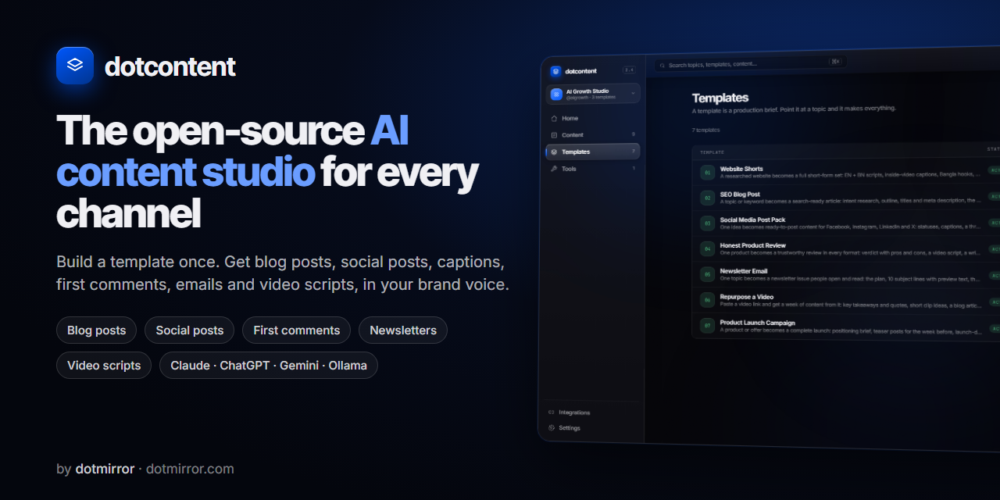
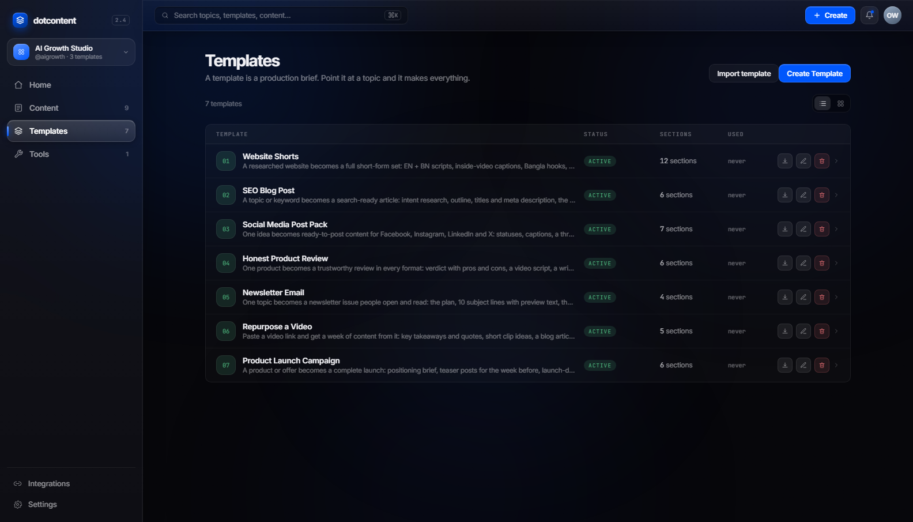
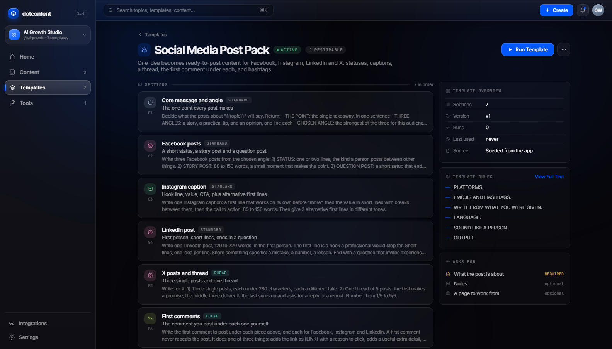
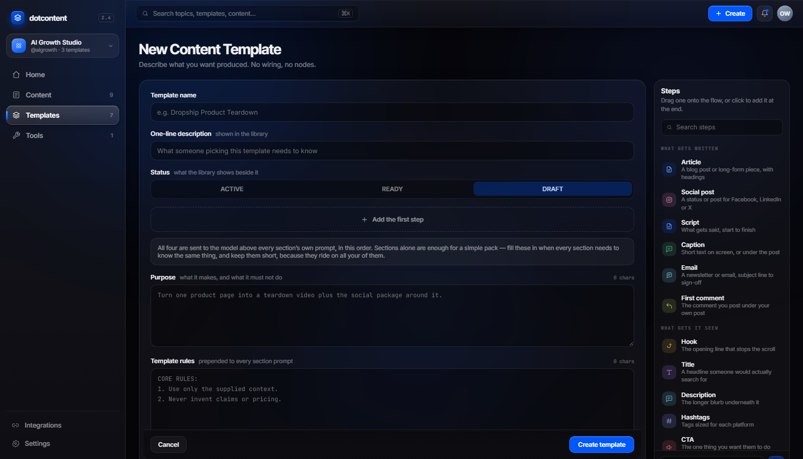
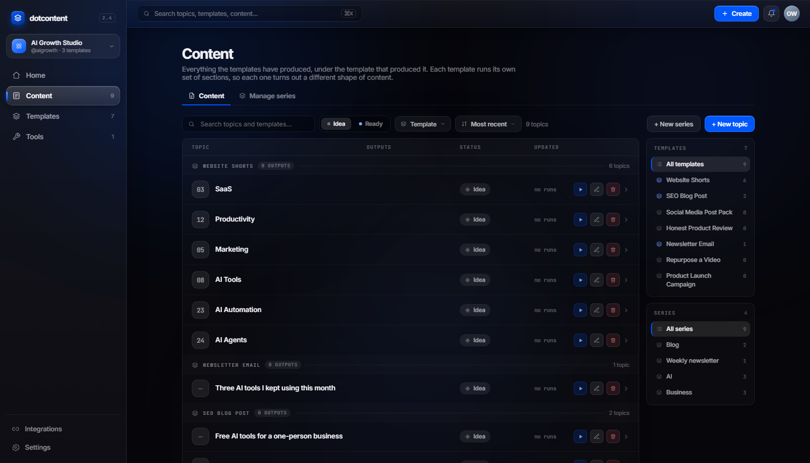
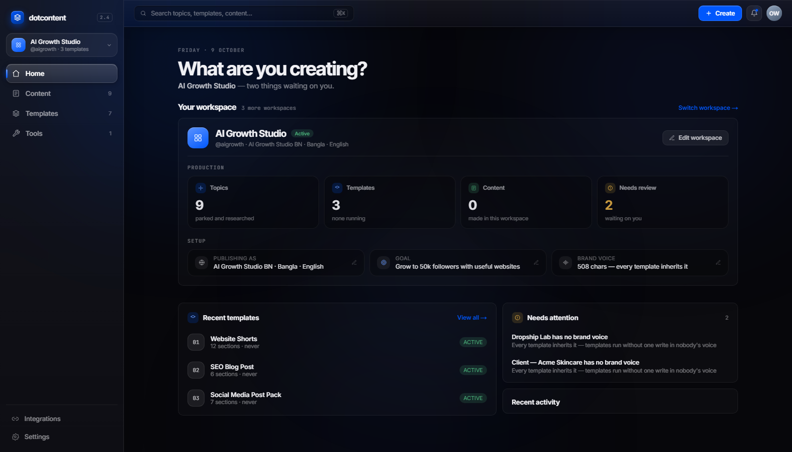
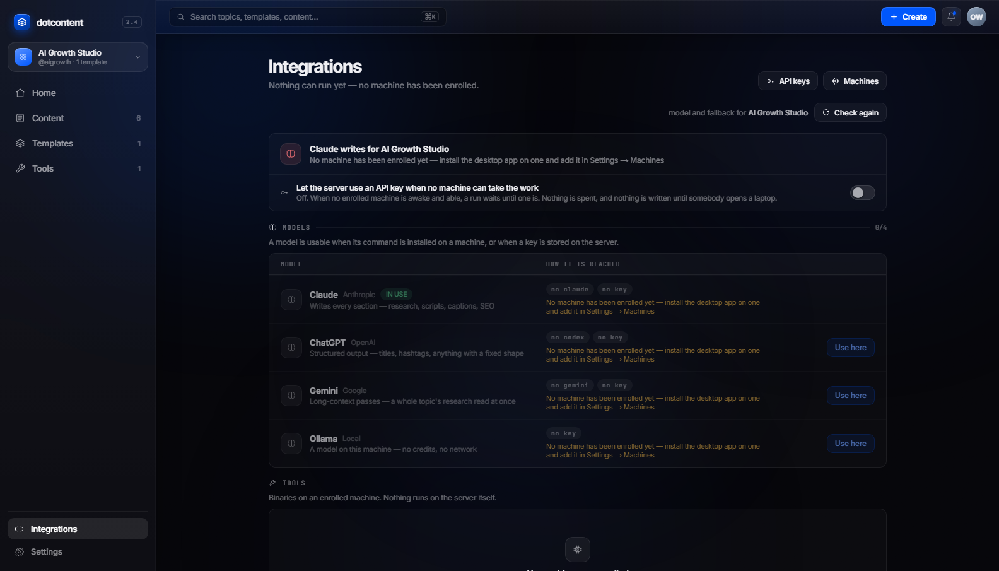

<div align="center">

<a href="https://github.com/shimentosh/dotcontent"></a>

# dotcontent

### The open-source AI content studio for every channel

Write a content **template** once, then turn any topic into everything it
needs: **blog posts, social media posts and captions, first comments,
newsletters, video scripts, product reviews, launch campaigns, hashtags and
SEO**. Written in your brand voice by Claude, ChatGPT, Gemini or a local
Ollama model. Self-hosted, team-ready, MIT licensed.

[](LICENSE)
[](https://nodejs.org)
[](https://nextjs.org)
[](https://nestjs.com)
[](CONTRIBUTING.md)
[](https://github.com/shimentosh/dotcontent/stargazers)

[**Quick start**](#quick-start) · [**Templates**](#templates-for-any-kind-of-content) · [**Features**](#features) · [**Screenshots**](#screenshots) · [**How it works**](#how-it-works) · [**FAQ**](#faq) · [**Docs**](#documentation)

Built by [**dotmirror**](https://dotmirror.com)

</div>

---

## What is dotcontent?

**dotcontent** is a free, open-source, self-hosted AI content generator for
any kind of content. You describe a piece of content once, as a
**template**: what it is for, the rules it follows, and the sections it is
made of. Then every **topic** you add, whether a keyword, a product, an idea,
a link or a video, becomes the whole set in one click.

One template might write a blog post with its outline, meta description, FAQ
and promotion posts. Another writes a week of Facebook statuses, Instagram
captions, LinkedIn posts and the first comment under each. Another writes a
product review in three formats, or a full launch campaign. Every piece comes
out in the same brand voice, and every section can read the ones written
before it, so nothing contradicts anything else.

It is made for bloggers, social media managers, agencies, creators,
newsletter writers, affiliate marketers and small marketing teams who are
tired of pasting the same prompt into a chat window every day.

## Templates for any kind of content

Seven example templates ship with the app, each a different kind of content.
Run them as they are, or copy one and make it yours.

| Template | Use it for | What you get |
|---|---|---|
| **SEO Blog Post** | Blogs, SEO, content marketing | Keyword and intent research, outline, titles and meta description, the full article, FAQ, social posts to promote it |
| **Social Media Post Pack** | Daily posting, social media management | Facebook statuses, Instagram caption, LinkedIn post, X posts and thread, **first comments**, hashtags |
| **Honest Product Review** | Affiliate sites, review channels, e-commerce | Verdict with pros and cons, video script, written review, caption with first comment, YouTube copy |
| **Newsletter Email** | Newsletters, email marketing | Issue plan, 10 subject lines with preview text, the email, a subscriber post |
| **Repurpose a Video** | Podcasts, YouTube, webinars | Takeaways and quotes, clip ideas, blog article, LinkedIn, Facebook and X posts, Instagram carousel |
| **Product Launch Campaign** | Brands, agencies, launches | Launch brief, teaser posts, launch-day posts, launch and reminder emails, video script, ad copy |
| **Website Shorts** | Reels, YouTube Shorts, TikTok | English and Bangla scripts, on-screen captions, hooks, social captions, hashtags, YouTube SEO |

**[Read the template guide →](docs/TEMPLATES.md)** It covers what every
template writes, how to run one, how to write your own, and more ideas:
YouTube long-form, podcast show notes, product descriptions, cold email, case
studies and more.

## Features

### 🧩 A template builder for any format
Build a template in three steps, without code. Drag in sections (Article,
Social post, Script, Caption, Email, First comment, Hook, Title, Description,
Hashtags, CTA, Research, Plan, or your own), write each one's instruction,
and set the order. Use placeholders like `{{topic}}` and `{{series}}`.
Export a template as a `.template.json` file and import it on another
console.

### ✍️ One click, a whole content package
Sections run in dependency order. Research is written before the article
that cites it, the outline before the draft, and the posts before the first
comments that sit under them. Sections that do not depend on each other are
queued together, so several machines can write them at once. A failed section costs only that section, and you
can rewrite it on its own.

### 🧠 Use the AI you already pay for: Claude, ChatGPT, Gemini or Ollama
Sections are written by the `claude` (Claude Code), `codex` (ChatGPT) or
`gemini` CLI already signed in on your computer. They are billed to your
existing subscription, not per token. An Anthropic API key or a fully local
[Ollama](https://ollama.com) model works too. Each workspace picks its own
model.

### 🗣️ One workspace per brand or client
Each workspace has its own brand voice, languages, goal and model, and every
section is written under that voice. Run the same template for two clients
and get two different voices. It writes in any language the model writes
well; the shipped Website Shorts template writes English and Bangla.

### 🎬 Video and web pages as sources
Paste a video link (YouTube, Reels, TikTok, a podcast clip) and the worker
downloads it with **yt-dlp**, cuts stills with **ffmpeg** and transcribes it
with **whisper.cpp**. Make a topic a web page's link and the server reads the
page. Either way, the content is written from the source, not from guesses.

### 👥 Built for teams
The console runs on one server. The writing happens on teammates' own
laptops, which **claim jobs from a queue**. Close the tab and the run carries
on; if a laptop goes to sleep, another machine picks the job up. Invite
teammates by link, and manage machines and tokens in Settings. An optional
**Windows desktop app** bundles the console and a worker.

### 🔒 Self-hosted and private
Your topics, prompts and content stay in your own Postgres. API keys are
encrypted with AES-256-GCM. Deploy with Docker Compose (Traefik and Let's
Encrypt included) or [Dokploy](https://dokploy.com).

## Screenshots

<table>
  <tr>
    <td width="50%"><br><sub><b>Templates:</b> seven examples, one for each kind of content</sub></td>
    <td width="50%"><br><sub><b>A template:</b> the Social Media Post Pack, section by section</sub></td>
  </tr>
  <tr>
    <td width="50%"><br><sub><b>Builder:</b> drag in Article, Social post, Email, First comment and more</sub></td>
    <td width="50%"><br><sub><b>Content:</b> topics grouped by template, one click to run</sub></td>
  </tr>
  <tr>
    <td width="50%"><br><sub><b>Home:</b> the current workspace and what is waiting on you</sub></td>
    <td width="50%"><br><sub><b>Integrations:</b> Claude, ChatGPT, Gemini and Ollama, probed live</sub></td>
  </tr>
</table>

## Quick start

You need:

| | |
|---|---|
| **Node.js 24** | Check with `node --version`. The worker runs TypeScript directly, which needs Node 22.18 or newer. |
| **Docker** | For Postgres. Docker Desktop on Windows and macOS. |
| **A model** | At least one of: [Claude Code](https://claude.com/claude-code) (`claude`), the Codex CLI (`codex`) or the Gemini CLI (`gemini`), signed in. Or an Anthropic API key, or [Ollama](https://ollama.com). |
| **bash** | `start.sh` is a bash script. On Windows, use Git Bash. |

```bash
git clone https://github.com/shimentosh/dotcontent.git
cd dotcontent
cp .env.example .env
./start.sh
```

`start.sh` installs the dependencies, starts Postgres in Docker (port 5437),
the API on <http://localhost:4000> and the console on <http://localhost:3333>.

1. **Open <http://localhost:3333> and sign up.** The first account becomes the
   owner, and after that sign-up closes. Invite the rest of the team from
   Settings.
2. **Add this computer as a machine.** Go to **Settings → Machines**, add one and
   copy the token (it is shown once). Put it in `.env`:

   ```bash
   DOTCONTENT_WORKER_TOKEN=wrk_…
   ```

   Stop `start.sh` (Ctrl+C) and run it again. It starts a worker as well.
3. **Check your model.** **Integrations** shows each CLI and tool the machine
   can reach. **Test** sends a real one-line prompt.
4. **Try a template.** Every sample workspace has topics waiting under a
   different template. Pick a workspace, open **Content**, and press Run on a
   topic. Then set your own brand voice in **Workspaces** and add your own
   topics.
5. **Optional, for video:** `npm run worker:setup` downloads pinned,
   checksummed yt-dlp, ffmpeg and whisper.cpp into `.data/tools`. It does not
   touch your PATH or need admin rights.

## How it works

```
 browser ──► console (Next.js, :3333)
    │
    └──────► API (NestJS, :4000) ──► Postgres
                ▲
                │  HTTPS: claim a job, post the result
                │
           worker(s) on your team's machines
           └─ runs claude / codex / gemini / ollama, yt-dlp, ffmpeg, whisper
```

Every section's prompt is built in the same order: the workspace's **brand
voice**, then the template's **purpose**, then its **rules**, then the
topic, any source page or video, and the sections it depends on.

1. **Press Run.** The API queues one job for each section whose inputs are ready.
2. **A worker claims it.** It runs the model CLI on its own machine, with that
   machine's login, and posts the finished text back.
3. **The next sections are queued** as soon as what they depend on is done.
4. **Read, edit, copy, download.** The reader groups sections into the
   deliverables the template declares: *Blog post*, *Promotion*, *Emails*.

The screens say *Template* where the code says `pack`, and *Machine* where it
says `worker`.

## Who it is for

- **Bloggers and SEO writers:** keyword research to published article, with
  the FAQ and promotion posts done too.
- **Social media managers:** a post for every platform from one idea, with
  the first comment and hashtags, every day.
- **Agencies:** one workspace per client, each with its own voice, and
  templates you reuse across all of them.
- **Creators and podcasters:** turn one video into clips, an article and a
  week of posts.
- **Affiliate and e-commerce sites:** honest reviews in video, blog and social
  formats from one set of facts.
- **Marketing teams:** a launch campaign, from teasers to the reminder email,
  that tells one consistent story.

## Deploying for a team

`docker-compose.prod.yml` runs Postgres, the API, the console and Traefik with
Let's Encrypt. `docker-compose.dokploy.yml` is the same app for Dokploy. Start
from `.env.production.example`. A server has no signed-in CLI, so either set
`ANTHROPIC_API_KEY` or leave the writing to your teammates' machines.
[docs/DEPLOYING.md](docs/DEPLOYING.md) has every step.

## FAQ

<details>
<summary><b>What kinds of content can dotcontent write?</b></summary>

Any text content: blog posts, social media posts and statuses, captions,
first comments, hashtags, newsletters and emails, video and podcast scripts,
product descriptions and reviews, ad copy, YouTube titles and descriptions,
and anything else you can describe in a template. It does not generate images
or audio.
</details>

<details>
<summary><b>Is dotcontent free?</b></summary>

Yes. dotcontent is open source under the MIT License: free to use, change and
self-host, including commercially. You pay only for the model you choose, and
with a CLI you already subscribe to there is no extra cost.
</details>

<details>
<summary><b>Do I need an OpenAI or Anthropic API key?</b></summary>

No. By default sections are written by the `claude`, `codex` or `gemini` CLI
signed in on a teammate's computer. An API key is optional. It is useful on a
server, or as a fallback when no machine is awake, and that fallback is off
until you turn it on.
</details>

<details>
<summary><b>Can I run it fully offline with a local model?</b></summary>

Yes. Point a workspace at [Ollama](https://ollama.com) and the writing,
including whisper.cpp transcription, runs on your own hardware.
</details>

<details>
<summary><b>Which languages does it support?</b></summary>

Any language the model writes well. Templates are plain instructions, and the
example templates write in whatever language the workspace's brand voice
asks for. The Website Shorts template writes English and Bangla.
</details>

<details>
<summary><b>Can I write my own templates?</b></summary>

Yes. That is the point. Start from scratch in the builder, or open one of the
examples and change it. Templates export and import as JSON files, so a team
can share them. See [the template guide](docs/TEMPLATES.md).
</details>

<details>
<summary><b>Does it post to Facebook, Instagram or my blog for me?</b></summary>

Not yet. dotcontent writes the content and you publish it with the tools you
already use.
</details>

## Documentation

| | |
|---|---|
| [Templates](docs/TEMPLATES.md) | Every example template, how to run one, and how to write your own |
| [How it works](docs/HOW-IT-WORKS.md) | The longer tour: the data model, sign-in, keys and video ingest |
| [Architecture](docs/ARCHITECTURE.md) | What lives where, the routes, and the data flows |
| [Worker](docs/WORKER.md) | The job queue, leases, machine tokens and the desktop app |
| [Developing](docs/DEVELOPING.md) | Running it, checking it, and the traps |
| [Deploying](docs/DEPLOYING.md) | Putting it on a server for a team (Docker Compose or Dokploy) |
| [Decisions](docs/DECISIONS.md) | Calls already made, and why |

## Project layout

```
app/          one page per route (Next.js App Router)
components/   the screens; components/ui is the UI kit every screen is built from
lib/          client state, theme; lib/packs holds the shipped templates
lib/server/   everything that touches the database
api/          the NestJS API, sharing lib/server with the root
worker/       the sidecar on a teammate's machine. It has no database.
src-tauri/    the optional Windows desktop app: the console plus a worker
tests/        vitest, pure functions only
docs/         the design, written down
```

## Contributing

Issues and pull requests are welcome, and so are new templates: export yours
from the builder and share it in an issue. Read
[CONTRIBUTING.md](CONTRIBUTING.md), then run the checks before you open a
pull request:

```bash
npm run check   # typecheck, lint, tests, and the API's typecheck
```

Please follow the [Code of Conduct](CODE_OF_CONDUCT.md). Report security
problems privately, as described in [SECURITY.md](SECURITY.md).

### Upgrading from Content OS

dotcontent used to be called *Content OS*. Every environment variable is now
`DOTCONTENT_*`. The old `CONTENTOS_*` names are still read when the new one is
not set, so existing `.env` files and deployments keep working. The Postgres
role, database and volume keep the name `contentos`, because renaming stored
data needs a migration, not a find-and-replace. Upgrading also adds the six
new example templates to your library; delete any you do not want and they
stay deleted.

## License

[MIT](LICENSE) © [dotmirror](https://dotmirror.com)

<div align="center">
<sub>If dotcontent saves you time, a ⭐ on GitHub helps other people find it.</sub>
</div>
